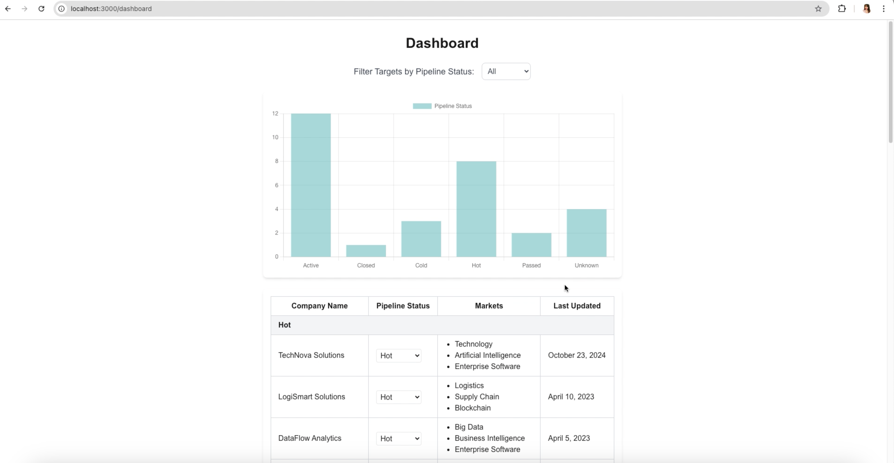

# Target Management Dashboard

## Getting Started

Clone this GitHub repository.

The first step is to install required dependencies:

```
npm install
```

You may also generate a production build for the project:

```
npm run build
```

Start the app:

```
npm start
```

Alternatively, run the app in dev mode:

```
npm run dev
```

Open your browser and navigate to http://localhost:3000 (or the URL shown in your terminal).

## Demo

<a href="./demo/TargetManagementDashboardDemo.mov" target="_blank">
  
</a>

<br>

**Note: This app is currently not supported in dark mode.**
